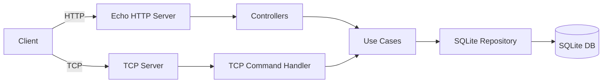
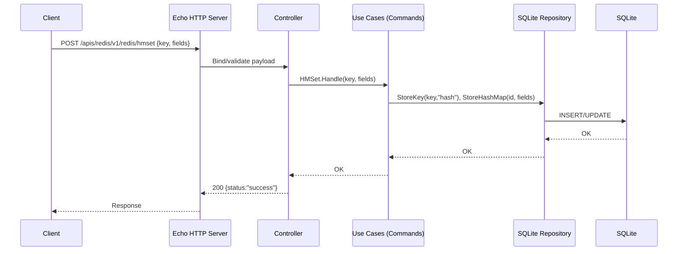
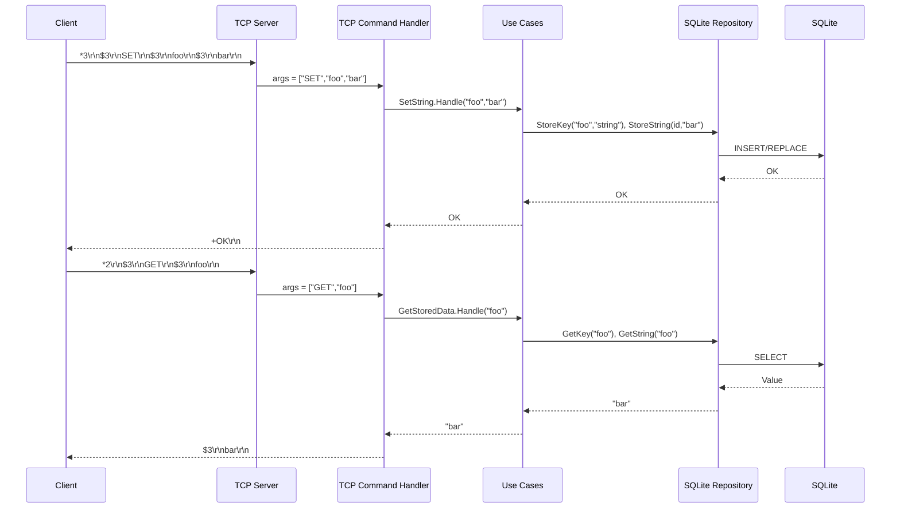
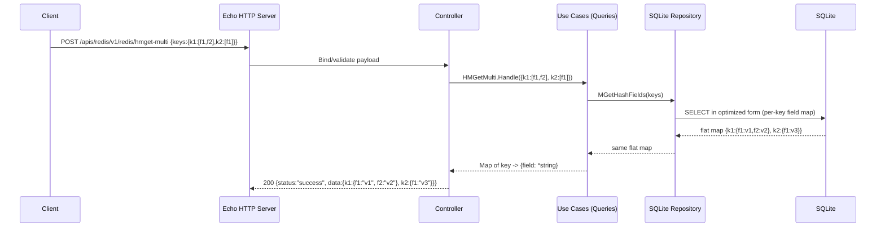

# Redis-lite Technical Architecture

This document provides a technical overview of the Redis-like server, including components, configuration, data flow, and lifecycle.

> Note: This project is a learning/utility tool, not a drop-in Redis replacement.

## High-level Architecture

- Clean/hexagonal architecture:
  - Input ports: HTTP (Echo) and Redis-compatible TCP server
  - Use cases: Commands (writes/mutations) and Queries (reads)
  - Interface adapters: SQLite repository with prepared statements and WAL
- Persistence: SQLite (./data/redis.db by default) with WAL and TTL enforcement on reads + periodic cleanup



## Repository Layout (abridged)
- cmd/ — main entrypoint (starts HTTP + TCP)
- internal/
  - infrastructure/
    - input-ports/http — Echo server, routes, controllers
    - input-ports/tcp — TCP server and RESP handling
    - interface-adapters/sqlite — repository and connection/pool
  - usecases/
    - redis/commands — write/maintenance operations
    - redis/queries — read operations
- config/ — Viper-based env-specific configs

## Components

### HTTP Server (Echo)
- Logging middleware, health endpoints: /, /health, /health-check
- Timeouts via net/http.Server:
  - ReadTimeout: 10s; WriteTimeout: 30s; IdleTimeout: 120s
- Bind address via env BIND_ADDR (default: 127.0.0.1) and PORT (default: 10001)
- Graceful shutdown on SIGINT/SIGTERM using Echo.Shutdown(ctx)

### TCP Server
- Listens on REDIS_TCP_PORT (default: 6379)
- Supports a subset of Redis commands: PING, ECHO, SET/GET/MSET/MGET, DEL/EXISTS, INCR, HASH ops (HSET/HGET/HMSET/HMGET/etc.), KEYS/SCAN, EXPIRE
- RESP array parsing and inline protocol fallback
- Keepalive enabled (best-effort), per-read deadlines to avoid idle connection leaks
- Graceful shutdown by closing the listener; active goroutines exit on read errors/EOF

### Use Cases
- Commands (examples):
  - SetString, MSet, HMSet, HSet, HDel, Incr, Expire, CleanupExpired
  - ParseRespToKeyValue, ParseAndStoreRespData, DeleteStoredData
- Queries (examples):
  - GetStoredData, MGet, HMGet, HMGetMulti, HGet/HExists, HKeys/HVals, HGetAll, HLEN, ScanKeys, ScanCursor

### Persistence (SQLite)
- WAL mode, synchronous=NORMAL, prepared statements for hot paths
- TTL behavior: TTL stored with keys; on read, expired keys are treated as not found and proactively deleted
- Periodic cleanup (every 30 min) via CleanupExpired use case

## Configuration

- GO_ENV: selects config/environments/<env> JSON files (development by default)
- PORT: HTTP port (default: 10001)
- BIND_ADDR: HTTP bind address (default: 127.0.0.1)
- REDIS_TCP_PORT: TCP server port (default: 6379)
- SQLITE_MAX_CONNECTION: max open connections (default: 25)
- SQLITE_MAX_IDLE_CONNECTION: max idle connections (default: 10)
- SQLite DB path: configured via Viper, typically ./data/redis.db

## Request/Command Flows

### HTTP Request Flow (example: HMSET via JSON)


### TCP Command Flow (example: SET/GET)


### SCAN Flow (cursor-based key iteration)
```mermaid
sequenceDiagram
  participant Client
  participant TCP as TCP Server
  participant H as TCP Command Handler
  participant UC as Use Cases (Queries)
  participant Repo as SQLite Repository
  participant DB as SQLite

  Client->>TCP: *4\r\n$4\r\nSCAN\r\n$1\r\n0\r\n$5\r\nMATCH\r\n$3\r\nfoo\r\n
  TCP->>H: args = ["SCAN","0","MATCH","foo"]
  H->>UC: ScanCursor.Handle(cursor=0, pattern="foo", count=default)
  UC->>Repo: Query for keys matching pattern with pagination
  Repo->>DB: SELECT key_name WHERE key_name LIKE pattern LIMIT count OFFSET...
  DB-->>Repo: keys, next offset
  Repo-->>UC: nextCursor, keys []
  UC-->>H: {Cursor, Keys}
  H-->>Client: *2; $<cursor>; *<len>; $k1; $k2; ...
```

### HMGET-MULTI Flow (multi-key hash field retrieval)


## Operational Playbook

### How to run (local)
- Dev server:
  - make run
  - or: GO_ENV=development BIND_ADDR=127.0.0.1 PORT=10001 REDIS_TCP_PORT=6379 go run ./cmd
- Docker:
  - docker build -t redis-lite:latest .
  - docker run --rm -p 10001:10001 -p 6379:6379 \
    -e GO_ENV=production -e PORT=10001 -e REDIS_TCP_PORT=6379 \
    -v $(pwd)/data:/srv/data redis-lite:latest

### Logs
- HTTP: structured access logs via Echo middleware
- Startup/shutdown/TTL cleanup logs on stdout
- For Docker, use: docker logs <container>

### Ports and bind addresses
- HTTP: PORT (default 10001); bind via BIND_ADDR (default 127.0.0.1)
- TCP: REDIS_TCP_PORT (default 6379); binds on 0.0.0.0 by default (via net.Listen)
- Recommend keeping default bind to 127.0.0.1 for local dev; explicitly set BIND_ADDR=0.0.0.0 for containerized deployment

### Environment variables
- GO_ENV: selects config (default development)
- PORT: HTTP port (default 10001)
- BIND_ADDR: HTTP bind address (default 127.0.0.1)
- REDIS_TCP_PORT: TCP port (default 6379)
- SQLITE_MAX_CONNECTION: max open conns (default 25)
- SQLITE_MAX_IDLE_CONNECTION: max idle conns (default 10)
- SQLite DB path via config JSON (default ./data/redis.db); ensure data dir exists

### Health checks
- HTTP: /, /health, /health-check
- Readiness (manual): check that DB opens and schema initializes; try a basic GET/SET via HTTP or TCP

### Graceful shutdown
- Send SIGINT/SIGTERM; server stops HTTP (with timeouts), closes TCP listener, stops message bus, and closes repository


### Graceful Shutdown Flow
```mermaid
flowchart TD
  S[SIGINT/SIGTERM] --> M[Main Loop]
  M --> GS[gracefulShutdown]
  GS --> MB[MessageBus.Stop]
  GS --> TCP[tcpServer.Close]
  GS --> ECHO[Echo.Shutdown(ctx, timeout=10s)]
  GS --> UC[useCases.Close]
  UC --> Repo[Repository.Close]
  Repo --> DB[(SQLite)]
  GS --> DONE[Exit]
```

## Error Handling and Observability

- HTTP: structured logging middleware; errors surfaced as JSON
- TCP: RESP error strings for protocol and handler errors
- Logging on startup, shutdown, maintenance, TTL cleanup
- Health endpoints: /, /health, /health-check
- Consider adding metrics (Prometheus) as a next step

## Testing & CI
- go test ./...; initial unit tests cover RESP parsing
- Recommend adding:
  - TCP handler tests (PING/ECHO/SET/GET/INCR)
  - Hash tests (HMSET/HMGET/HMGET-MULTI)
  - TTL/EXPIRE tests
- GitHub Actions workflow runs lint + tests on push/PR

## Deployment
- Dockerfile uses CGO for github.com/mattn/go-sqlite3
- Example run:
  - docker build -t redis-lite:latest .
  - docker run --rm -p 10001:10001 -p 6379:6379 \
    -e PORT=10001 -e REDIS_TCP_PORT=6379 \
    -v $(pwd)/data:/srv/data redis-lite:latest

## Future Enhancements
- Structured logging with zap/zerolog, request IDs, correlation
- Metrics (Prometheus), pprof endpoints in dev
- OpenAPI spec for HTTP API; expand examples
- Optional modernc.org/sqlite for pure-Go builds if CGO is undesirable

